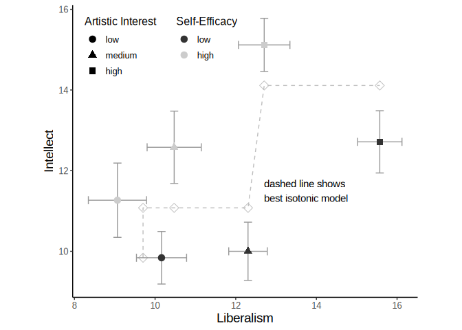
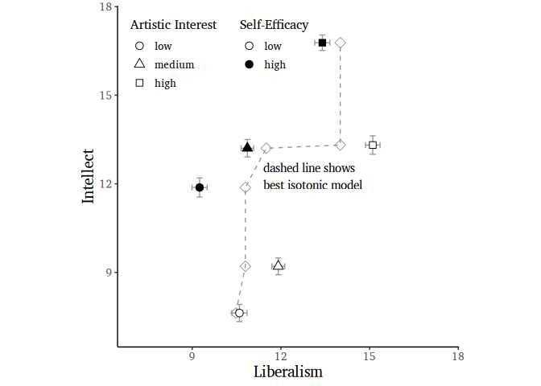

# STA openness (liberalism and intellect)


This repository accompanies the paper *Perceived Liberalism and
Intellect Cannot Be Reduced to a Single Openness Dimension: A
State-Trace Experiment*

## Repository contents

- [`materials.md`](materials.md) documents the vignette procedure, all six
  experimental conditions, the exact German item wording, response scales,
  outcome measures, manipulation checks, and attention checks.
- `between.csv` and `within.csv` are the analysis-ready datasets used below.
- `Main_Study/Data` contains the main exported dataset and its data
  documentation.
- `Main_Study/Scripts` contains the detailed original analysis workflow.
- `Pilot_Study` contains the corresponding pilot-study data, documentation,
  and scripts.

The repository is connected to the article's anonymous OSF project for peer
review. The OSF project will be made public for publication.

Note that this repository corresponds to the *article* version of the
analysis. Compared to the original thesis scripts, the code has been
substantially shortened and simplified.

If you require more detailed data handling or additional analyses,
please refer to the `Main_Study` folder. Be aware, however, that the
code there is considerably more difficult to follow. In particular, the
original implementation relies on the *STACMR-R* scripts, which must be
installed manually because they are not properly packaged for R.

In the present file, we instead use a wrapper package called *stacmr*,
which enables a more streamlined and reproducible workflow. If your goal
is simply to reproduce the reported results or to conduct additional
analyses using the main dataset, you can proceed with the code below.

## Required packages

We begin by loading the required libraries. Throughout this project, we
use **librarian** as a package manager. If you do not have it installed,
please install it first or substitute it with your preferred
alternative.

``` r
# A recent JRP production article uses Charis SIL for body text. The font and its SIL
# Open Font License are vendored in this repository so figure export does not
# depend on a machine-wide font installation.
figure_font <- "Charis SIL"
font_config <- normalizePath("fonts/fonts.conf", mustWork = TRUE)
Sys.setenv(FONTCONFIG_FILE = font_config)
font_match <- system2("fc-match", shQuote(figure_font), stdout = TRUE)
if (!length(font_match) || !grepl("CharisSIL-Regular.ttf", font_match[[1]], fixed = TRUE)) {
  stop("The vendored Charis SIL font could not be resolved through fontconfig.")
}

librarian::shelf(car, readr, dplyr, tidyr, effectsize, psych, lsr,
devtools, monotonicity/stacmr, tidyverse, simpleCache)
setCacheDir("cache")
```

## Between analysis

Load the data:

``` r
d <- read_csv("between.csv",
              col_type = list(iv_se = "f", iv_ai = "f", iv_comb = "f"))
# correct factor ordering
d$iv_se <- forcats::fct_relevel(d$iv_se, c("low", "high"))
d$iv_ai <- forcats::fct_relevel(d$iv_ai, c("low", "medium", "high"))
```

### Manipulation check with C05SE and O98AI:

SE: Self-Efficacy AI: Artistic Interest

The items **C05SE** and **O98AI** served as manipulation checks and were
not included in the vignette itself. If the vignette successfully
induces the intended manipulation, these items should show a strong
correlation with the manipulation variable.

``` r
cor.test(d$C05SE, as.numeric(d$iv_se))
```


        Pearson's product-moment correlation

    data:  d$C05SE and as.numeric(d$iv_se)
    t = 13.753, df = 111, p-value < 2.2e-16
    alternative hypothesis: true correlation is not equal to 0
    95 percent confidence interval:
     0.7137746 0.8534144
    sample estimates:
          cor 
    0.7938332 

``` r
cor.test(d$O98AI, as.numeric(d$iv_ai), method = "s")
```

    Warning in cor.test.default(d$O98AI, as.numeric(d$iv_ai), method = "s"): cannot
    compute exact p-value with ties


        Spearman's rank correlation rho

    data:  d$O98AI and as.numeric(d$iv_ai)
    S = 66114, p-value < 2.2e-16
    alternative hypothesis: true rho is not equal to 0
    sample estimates:
          rho 
    0.7250567 

### STA

make long format:

``` r
between_long <- as.data.frame(pivot_longer(d,
  cols = c("LibSum", "IntSum"),
  names_to = "DV",
  values_to = "Sum"
)) 
between_long$DV <- as.factor(between_long$DV)
```

``` r
stats <- sta_stats(data = between_long, col_value = "Sum", 
                   col_participant = "id",
                   col_dv = "DV", col_between = "iv_comb")
stats
```

      IntSum LibSum      between N_IntSum N_LibSum
    1  10.00  12.30  low, medium       23       23
    2  12.71  15.57    low, high       14       14
    3   9.84  10.16     low, low       25       25
    4  11.27   9.07    high, low       15       15
    5  12.58  10.47 high, medium       19       19
    6  15.12  12.71   high, high       17       17

We would usually specify a partial order at this stage. However, since
the partial order already exhibits a perfect fit, this step can be
omitted.

``` r
set.seed(1)
simpleCache("res1", {cmr(between_long, col_value = "Sum", 
                         col_participant = "id",
                         col_dv = "DV", col_between = "iv_comb", nsample=1e5)})
```

    ::Loading cache::   cache/res1.RData

``` r
res1
```


    CMR fit to 6 data points with call:
    cmr(data = between_long, col_value = "Sum", col_participant = "id", 
        col_dv = "DV", col_between = "iv_comb", nsample = 100000)

    DVs: IntSum & LibSum 
    Within: NA 
    Between: iv_comb 

    Fit value (SSE): 11.3
    Fit difference to MR model (SSE): 11.99
    p-value (based on 100000 samples): 0.0143 

``` r
res1$estimate
```

        IntSum    LibSum      between N_IntSum
    1 11.07737 12.304348  low, medium       23
    2 14.11149 15.571429    low, high       14
    3  9.84000  9.701429     low, low       25
    4 11.07737  9.701429    high, low       15
    5 11.07737 10.473684 high, medium       19
    6 14.11149 12.705882   high, high       17

### ST Plot

Although the *stacmr* package provides a dedicated function for this
purpose, it does not produce a publication-ready plot. We therefore
extract the relevant data and construct the ST plot manually.

``` r
# Data for the Plot
d_agg <- data.frame(x_mean = stats$LibSum$means, y_mean = stats$IntSum$means,
                    x_se = sqrt(diag(stats$LibSum$cov) / diag(stats$LibSum$n)),
                    y_se = sqrt(diag(stats$IntSum$cov) / diag(stats$IntSum$n)),
                    iv_comb = stats$IntSum$conditions)

d_agg <- d_agg %>% mutate(x_min = x_mean - x_se,  # Define lower and upper limits for error bars
  x_max = x_mean + x_se,
  y_min = y_mean - y_se,
  y_max = y_mean + y_se)

d_agg <- d_agg %>%
  separate(iv_comb, into = c("Self-Efficacy", "Artistic Interest"))
# correct factor ordering
d_agg$`Self-Efficacy` <- forcats::fct_relevel(d_agg$`Self-Efficacy`, c("low", "high"))
d_agg$`Artistic Interest` <- forcats::fct_relevel(d_agg$`Artistic Interest`, c("low", "medium", "high"))

d_cmr <- as.data.frame(res1$estimate)

# ggplot
p1 <- ggplot(d_agg, aes(x_mean, y_mean)) +
  geom_point(data = d_cmr, aes(LibSum, IntSum), color = "grey60",
             shape = 5, size = 3) +  # Add predicted Points (Regression)
  geom_line(data = d_cmr, aes(LibSum, IntSum), color = "grey60", linetype = "dashed") +  # grey curve for Regression model
  geom_errorbar(aes(ymin = y_min, ymax = y_max), color = "grey60", width = 0.2) +  # y-Axis Error bars
  geom_errorbarh(aes(xmin = x_min, xmax = x_max), color = "grey60", height = 0.2) +  # Add x-Axis Error Bars
  geom_point(aes(shape = `Artistic Interest`, fill = `Self-Efficacy`),
             color = "black", size = 3) +  # open low SE, filled high SE
  scale_shape_manual(values = c(21, 24, 22)) +  # fillable circle, triangle, square
  scale_fill_manual(values = c(low = "white", high = "black")) +
  guides(fill = guide_legend(override.aes = list(shape = 21))) +

  labs(
    x = "Liberalism",
    y = "Intellect",
  ) +
  # xlim(4, 20) +
  # ylim(4, 20) +
  
  theme_bw(base_family = figure_font) +
  theme(
    text = element_text(family = figure_font),
    axis.title = element_text(size = 14),
    axis.text = element_text(size = 10),
    legend.title = element_text(size = 12),
    legend.text = element_text(size = 10),
    panel.grid = element_blank(),
    legend.background = element_blank(),
    legend.key = element_blank(),
    panel.border = element_blank(),
    axis.line = element_line(color = "black"),
    legend.box = "horizontal",
    legend.position = c(0.02, 0.98),   # x, y in NPC coordinates (0 = left/bottom, 1 = right/top)
    legend.justification = c("left", "top")
  ) +
  coord_fixed(ratio = 1) + 
  annotate("text", 12.7, 11.5, label = "dashed line shows\nbest isotonic model",
           hjust = 0, family = figure_font)
```

    Warning: `geom_errorbarh()` was deprecated in ggplot2 4.0.0.
    ℹ Please use the `orientation` argument of `geom_errorbar()` instead.

``` r
p1
```

    `height` was translated to `width`.



## Within analysis

``` r
d <- read_csv("within.csv",
              col_type = list(iv_se = "f", iv_ai = "f", iv_comb = "f",
                              dv = "f"))
# correct factor ordering
d$iv_se <- forcats::fct_relevel(d$iv_se, c("low", "high"))
d$iv_ai <- forcats::fct_relevel(d$iv_ai, c("low", "medium", "high"))
within = as.data.frame(d)
```

``` r
stats <- sta_stats(data = within, col_value = "sum", 
                   col_participant = "id",
                   col_dv = "dv", col_within = "iv_comb")
stats
```

      LibSum IntSum       within between N_LibSum N_IntSum
    1  15.11  13.31    low, high       1      112      112
    2   9.25  11.88    high, low       1      112      112
    3  11.91   9.21  low, medium       1      112      112
    4  10.87  13.21 high, medium       1      112      112
    5  13.40  16.78   high, high       1      112      112
    6  10.60   7.62     low, low       1      112      112

We would usually specify a partial order at this stage. However, since
the partial order already exhibits a perfect fit, this step can be
omitted.

``` r
set.seed(1)
simpleCache("res2", {cmr(within, col_value = "sum", 
                         col_participant = "id",
                         col_dv = "dv", col_within = "iv_comb", nsample = 1e5)})
```

    ::Loading cache::   cache/res2.RData

``` r
res2
```


    CMR fit to 6 data points with call:
    cmr(data = within, col_value = "sum", col_participant = "id", 
        col_dv = "dv", col_within = "iv_comb", nsample = 100000)

    DVs: LibSum & IntSum 
    Within: iv_comb 
    Between: NA 

    Fit value (SSE): 85.32
    Fit difference to MR model (SSE): 85.32
    p-value (based on 100000 samples): 0 

``` r
res2$estimate
```

        LibSum    IntSum       within between
    1 14.00825 13.312500    low, high       1
    2 10.79788 11.875000    high, low       1
    3 10.79788  9.205357  low, medium       1
    4 11.50574 13.205357 high, medium       1
    5 14.00825 16.776786   high, high       1
    6 10.47531  7.625000     low, low       1

### ST Plot

Although the *stacmr* package provides a dedicated function for this
purpose, it does not produce a publication-ready plot. We therefore
extract the relevant data and construct the ST plot manually.

Note that in the thesis, standard errors were not calculated correctly
and were consequently overestimated. The approach used below follows
exactly the same procedure as implemented in the *stacmr* package.

``` r
# Data for the Plot
d_agg <- data.frame(x_mean = stats$LibSum$means, y_mean = stats$IntSum$means,
                    x_se = sqrt(diag(stats$LibSum$cov) / diag(stats$LibSum$n)),
                    y_se = sqrt(diag(stats$IntSum$cov) / diag(stats$IntSum$n)),
                    iv_comb = names(stats$IntSum$conditions))

d_agg <- d_agg %>% mutate(x_min = x_mean - x_se,  # Define lower and upper limits for error bars
  x_max = x_mean + x_se,
  y_min = y_mean - y_se,
  y_max = y_mean + y_se)
d_agg
```

                   x_mean    y_mean      x_se      y_se      iv_comb     x_min
    low, high    15.10714 13.312500 0.2459354 0.3098179    low, high 14.861207
    high, low     9.25000 11.875000 0.2570746 0.3219552    high, low  8.992925
    low, medium  11.91071  9.205357 0.2192700 0.2837933  low, medium 11.691444
    high, medium 10.86607 13.205357 0.2126033 0.2956256 high, medium 10.653468
    high, high   13.40179 16.776786 0.2561301 0.2608335   high, high 13.145656
    low, low     10.59821  7.625000 0.2567519 0.2899037     low, low 10.341462
                     x_max     y_min     y_max
    low, high    15.353078 13.002682 13.622318
    high, low     9.507075 11.553045 12.196955
    low, medium  12.129984  8.921564  9.489150
    high, medium 11.078675 12.909732 13.500983
    high, high   13.657916 16.515952 17.037619
    low, low     10.854966  7.335096  7.914904

``` r
d_agg$iv_comb = rownames(d_agg)

d_agg <- d_agg %>%
  separate(iv_comb, into = c("Self-Efficacy", "Artistic Interest"))
# correct factor ordering
d_agg$`Self-Efficacy` <- forcats::fct_relevel(d_agg$`Self-Efficacy`, c("low", "high"))
d_agg$`Artistic Interest` <- forcats::fct_relevel(d_agg$`Artistic Interest`, c("low", "medium", "high"))

d_cmr <- as.data.frame(res2$estimate)

# ggplot
p2 <- ggplot(d_agg, aes(x_mean, y_mean)) +
  geom_point(data = d_cmr, aes(LibSum, IntSum), color = "grey60",
             shape = 5, size = 3) +  # Add predicted Points (Regression)
  geom_line(data = d_cmr, aes(LibSum, IntSum), color = "grey60", linetype = "dashed") +  # grey curve for Regression model
  geom_errorbar(aes(ymin = y_min, ymax = y_max), color = "grey60", width = 0.2) +  # y-Axis Error bars
  geom_errorbarh(aes(xmin = x_min, xmax = x_max), color = "grey60", height = 0.2) +  # Add x-Axis Error Bars
  geom_point(aes(shape = `Artistic Interest`, fill = `Self-Efficacy`),
             color = "black", size = 3) +  # open low SE, filled high SE
  scale_shape_manual(values = c(21, 24, 22)) +  # fillable circle, triangle, square
  scale_fill_manual(values = c(low = "white", high = "black")) +
  guides(fill = guide_legend(override.aes = list(shape = 21))) +
  labs(
    x = "Liberalism",
    y = "Intellect",
  ) +
   xlim(7, 17.5) +
   ylim(7, 17.5) +
  
  theme_bw(base_family = figure_font) +
  theme(
    text = element_text(family = figure_font),
    axis.title = element_text(size = 14),
    axis.text = element_text(size = 10),
    legend.title = element_text(size = 12),
    legend.text = element_text(size = 10),
    panel.grid = element_blank(),
    legend.background = element_blank(),
    legend.key = element_blank(),
    panel.border = element_blank(),
    axis.line = element_line(color = "black"),
    legend.box = "horizontal",
    legend.position = c(0.02, 0.98),   # x, y in NPC coordinates (0 = left/bottom, 1 = right/top)
    legend.justification = c("left", "top")
  ) +
  coord_fixed(ratio = 1) + 
  annotate("text", 11.4, 12.25, label = "dashed line shows\nbest isotonic model",
           hjust = 0, family = figure_font)
p2
```

    `height` was translated to `width`.


